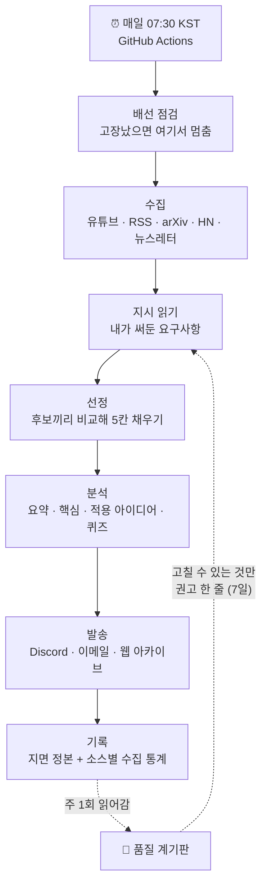
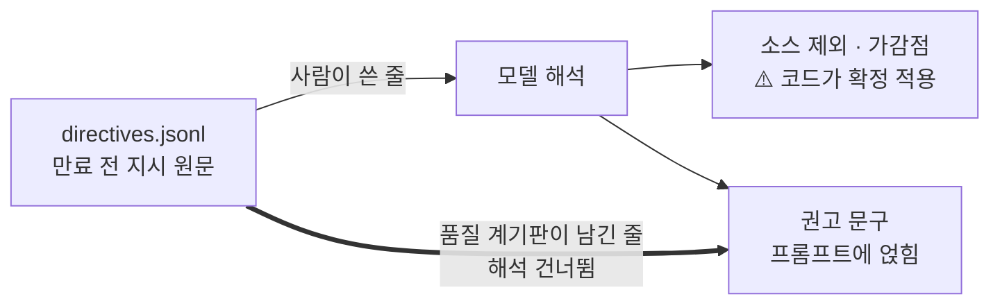

# DS Digest 🗞️

**매일 아침, 읽을 만한 것 5개만 골라서 보내주는 개인 뉴스레터**

유튜브, 기술 블로그, 논문, 해커뉴스에서 어제 나온 것들을 모아 읽고, 그중 다섯 개를 골라
요약과 적용 아이디어, 퀴즈를 붙여 Discord 와 이메일로 보냅니다.

---

## 이게 푸는 문제

읽을 것은 너무 많고 시간은 없습니다. 그래서 "모아서 보여주는" 도구는 이미 많습니다.
문제는 모아만 주면 더 큰 읽을거리 더미가 생긴다는 것입니다.

이 시스템이 하는 일은 모으는 게 아니라 **버리는 것**입니다. 하루에 100건 넘게 들어오는
후보 중 95개를 버리고 5개만 남깁니다.

### 왜 어려운가

순진하게 만들면 이렇게 됩니다. "AI 한테 점수를 매기게 하고 7점 넘는 것만 보내자."
실제로 그렇게 만들었다가 두 가지가 터졌습니다.

- **점수가 한가운데 몰립니다.** 모델에게 기사 하나를 주고 10점 만점으로 매기라고 하면
  거의 다 6~7점을 줍니다. 문턱을 7점에 두면 어떤 날은 전부 통과하고 어떤 날은 전부
  탈락해서 빈 다이제스트가 나갑니다.
- **고장이 조용합니다.** arXiv 수집 주소가 `http` 로 적혀 있어서 5개월간 논문이 한 건도
  안 들어왔는데, 아무 오류도 나지 않았습니다. "오늘은 새 논문이 없었다"와 구분이 안 됐습니다.

그래서 지금은 **절대 점수를 버리고 후보끼리 비교해서 순위를 매기고**, 무엇이 조용히
죽었는지 매주 따로 재는 장치를 붙였습니다.

---

## 하루 흐름



점선이 되먹임입니다. 계기판은 **이미 나간 지면을 채점**하고, 고칠 수 있는 항목만
다음 날 큐레이션에 한 줄로 되돌려 보냅니다.

---

## 핵심 개념 4개

### 1. 5칸짜리 지면

지면은 하루 5칸으로 고정입니다. 칸이 고정이면 "몇 점 이상인가"가 아니라
**"오늘 들어온 것 중 상위 5개는 무엇인가"** 를 물으면 됩니다. 빈 다이제스트가
구조적으로 안 나옵니다.

극장 좌석과 같습니다. 좌석은 정해져 있고, 누구를 앉힐지만 정하면 됩니다.
다만 비유가 깨지는 곳이 있습니다. 극장은 표를 판 순서대로 앉히지만, 여기서는
**어제 이미 보낸 것은 다시 앉히지 않습니다.** 한 번 나간 URL 은 30일간 제외됩니다.

### 2. 한국말로 쓰는 지시

Discord 에 "논문보다 실무 사례 위주로" 라고 쓰면 다음 날 반영됩니다. 이 문장은
두 갈래로 쓰입니다.

- **코드로 확정 적용** - "arxiv 그만" 같은 말은 후보에서 아예 빼야 합니다.
  프롬프트로 부탁하면 지킬 때도 있고 안 지킬 때도 있습니다.
- **프롬프트에 얹기** - "요약을 더 짧게" 같은 말은 코드로 표현할 방법이 없습니다.

모든 지시에는 만료일이 붙습니다(사람이 쓴 것 14일). 3개월 전 "arxiv 그만"이 영원히
살아 있으면 왜 논문이 안 오는지 아무도 모르게 되기 때문입니다.

### 3. 품질 계기판

주 1회, 이미 나간 지면을 되짚어 12가지를 잽니다. 태그가 한쪽으로 쏠렸는지,
관련도 점수가 다시 한 값에 몰렸는지, 퀴즈 개수가 매번 똑같은지 같은 것들입니다.

여기서 중요한 구분이 있습니다. **계기판은 조향 장치가 아닙니다.** 파이프라인 코드는
계기판을 전혀 참조하지 않습니다. 계기판이 할 수 있는 일은 두 가지뿐입니다.

- 실패하면 Discord 와 이메일로 **무엇이** 문제인지 알립니다
- 글쓰기 지시로 고칠 수 있는 항목이면 다음 날 권고 한 줄을 남깁니다 (7일 후 자동 만료)

### 4. 조용한 실패를 시끄럽게 만들기

가장 비싼 고장은 터지는 고장이 아니라 **아무 소리도 안 나는 고장**입니다.

- arXiv 주소 오타로 5개월간 0건 → 오류 없음
- 기술 블로그가 수집기를 차단(403) → "새 글이 없었다"와 구분 안 됨
- 품질 게이트가 8주 연속 실패 → 알림이 아무도 안 보는 채널로 발송

그래서 지금은 수집 실패를 상태 코드와 함께 기록하고, 소스별로 "설정돼 있는데 수집이
0건인 상태"를 따로 셉니다. 30일 넘게 0건이면 품질 게이트가 막힙니다.

---

## 지시가 갈라지는 지점

계기판이 자동으로 남긴 권고는 **모델 해석을 거치지 않습니다.**



검증할 때 일부러 규칙을 어기는 모델을 넣었더니, 계기판이 남긴 줄 하나로 arXiv 가
통째로 빠졌습니다. 지표가 한 번 튀었다고 소스가 사라지면 그날 지면이 비고, 원인은
어디에도 안 적힙니다. 그래서 **프롬프트로 부탁하는 대신 경로 자체를 갈랐습니다.**

---

## 수집 소스

| 소스 | 개수 | 수집 창 | 비고 |
|---|---|---|---|
| YouTube | 채널 7개 | 최근 업로드 | 채널 RSS 사용, API 키 불필요 |
| 기술 블로그 RSS | 7개 | 48시간 | 토스, 당근, 카카오, D2, Netflix, Airbnb, Spotify |
| arXiv | 카테고리 14개 | 120시간 | 월~금 00:00 UTC 발표, 주말 공백을 덮는 창 |
| Hacker News | 키워드 | 24시간 | 점수 문턱 있음 |
| 뉴스레터 | 5개 | 168시간 | 주간 발행이 많아 창이 김 |

arXiv 창만 유독 긴 이유가 있습니다. arXiv 는 평일 자정(UTC)에만 새 목록을 내고,
각 발표에는 **직전 영업일 오후 6시까지 제출된** 논문이 들어갑니다. 48시간으로 재면
월요일 실행에서 가장 새 논문조차 76시간이 지나 있어 전부 걸러졌습니다.

---

## 품질 지표

| 지표 | 창 | 기준 | 등급 | 2026-09-16 |
|---|---|---|---|---|
| 태그 다양성 | 14일 | < 0.70 | WARN | 0.986 |
| 최빈 태그 집중도 | 14일 | > 0.40 | FAIL | 0.136 |
| 관련도 점수 IQR | 14일 | < 1.5 | FAIL | 2.0 |
| 관련도 고유값 수 | 14일 | < 5 | FAIL | 6 |
| YouTube 타임스탬프 비율 | 14일 | < 0.70 | FAIL | 0.765 |
| 적용 아이디어 개수 고정률 | 14일 | > 0.95 | FAIL | 0.644 |
| 퀴즈 개수 고정률 | 14일 | > 0.95 | FAIL | 0.847 |
| 한 줄 요약 평균 길이 | 14일 | < 20, > 30 | WARN | 30.05 |
| 중복 URL 비율 | 전체 | > 0.05 | FAIL | 0.009 |
| 30일 이상 미등장 소스 | 전체 | > 0 | WARN | 2 |
| 수집되나 미발송인 계열 | 전체 | > 0 | WARN | 4 |
| 장기간 수집 0건인 계열 | 전체 | > 0 | FAIL | 0 |

FAIL 이 하나라도 걸리면 게이트가 막히고 알림이 나갑니다. WARN 은 보고만 합니다.
경고 하나가 게이트를 영구히 빨간불로 묶으면 실패가 신호가 아니라 소음이 되기 때문입니다.

지표를 두 창으로 나눈 이유도 같습니다. 전체 기간으로만 재면 **이미 고친 버그가
영원히 FAIL 로 남습니다.** 42일 평균은 고장나 있던 구간에 지배되고, 그 창은 계속
커지므로 저절로 회복되지 않습니다.

---

## Quick Start

```bash
# 1. 환경 설정
cp .env.example .env
# .env 에 API 키 입력

# 2. 의존성 설치 (가상환경 권장)
python -m venv .venv && .venv/bin/pip install -r requirements.txt

# 3. 발송 전 배선 점검 (API 키 불필요, 1초)
.venv/bin/python scripts/preflight.py

# 4. 수집 + 분석 (수동 실행)
.venv/bin/python -m app.jobs.daily_digest

# 5. 품질 계기판
.venv/bin/python -m evals.run --baseline

# 6. 테스트
.venv/bin/python -m pytest tests/ -q
```

> `.venv/bin/pytest` 나 시스템 `python3` 로 돌리면 모듈을 못 찾거나 일부 지표가
> 조용히 비어버립니다. 위 형태를 그대로 쓰세요.

---

## Tech Stack

| 구성 | 도구 | 비고 |
|---|---|---|
| 프레임워크 | FastAPI | 피드백 수신 + 아카이브 뷰어 |
| AI | Gemini 2.5 Flash / Groq | 선정 · 요약 · 퀴즈 생성 |
| DB | Supabase | 발송 URL 기록(30일), 사용자 프로필 |
| 발송 | Discord Bot + Resend | Discord 가 정본, 이메일 병행 |
| 스케줄러 | GitHub Actions | 다이제스트 매일 07:30 KST, 계기판 월요일 09:00 KST |
| 아카이브 | GitHub Pages | `docs/` 자동 push |

---

## Environment Variables

| 변수 | 필수 | 설명 |
|---|---|---|
| `GEMINI_API_KEY` | ✅ | Google AI Studio |
| `GROQ_API_KEY` | - | Groq (Gemini 대안) |
| `SUPABASE_URL` / `SUPABASE_KEY` | ✅ | 발송 URL 기록 |
| `DELIVERY_CHANNELS` | ✅ | 기본값 `discord` |
| `DISCORD_BOT_TOKEN` / `DISCORD_CHANNEL_ID` | ✅ | 발송 · 피드백 수거 · 실패 알림 |
| `RESEND_API_KEY` | - | 이메일 발송 |
| `EMAIL_FROM` / `EMAIL_TO` | - | 이메일 주소 |
| `TELEGRAM_BOT_TOKEN` / `TELEGRAM_CHAT_ID` | - | 발송 폴백 (피드백 수거는 Discord 전용) |
| `YOUTUBE_CHANNELS` | - | 채널 ID 쉼표 구분 |
| `RSS_FEEDS` | - | RSS URL 쉼표 구분 |
| `ARXIV_CATEGORIES` | - | 비우면 기본 14개 카테고리 |
| `HACKERNEWS_KEYWORDS` | - | 기본값 `machine learning,MLOps,...` |

---

## Archive Viewer

매일 생성된 다이제스트는 `docs/` 에 저장되어 GitHub Pages 로 공개됩니다.

**설정**: 레포 → Settings → Pages → Source: `main` / `/docs` → Save

로컬에서는 `uvicorn app.main:app --reload` 후 `http://localhost:8000/archive` 에서 볼 수 있습니다.

---

## 이해했는지 확인하는 질문

정의를 묻는 질문이 아니라 판단을 묻는 질문입니다. 막히면 위에서 해당 절을 다시 보세요.

1. 어느 날 다이제스트가 빈 채로 나갔다. 관련도 점수 문턱을 낮추는 게 답일까?
2. 품질 게이트가 "요약 평균 길이가 짧아졌다"며 실패했다. 이건 고쳐야 할 문제인가?
3. arXiv 수집이 토·일·월에만 0건이다. 수집기가 고장난 것인가?
4. 계기판이 "태그가 한쪽으로 쏠렸다"고 판단했다. 이 신호는 어디까지 갈 수 있고, 어디부터는 갈 수 없는가?
5. 새 기술 블로그를 소스에 추가했는데 첫날 수집이 0건이다. 게이트에 무슨 일이 생기는가?

---

## 더 읽을 것

- **[PROGRESS.md](PROGRESS.md)** - 고장과 수정의 기록. 각 항목이 증상 · 진단 · 원인 · 수정 순서로 적혀 있습니다
- **`evals/thresholds.py`** - 품질 지표의 정본. 각 기준값 옆에 왜 그 값인지 주석이 있습니다
- **`app/directives.py`** - 지시가 두 갈래로 갈리는 지점
